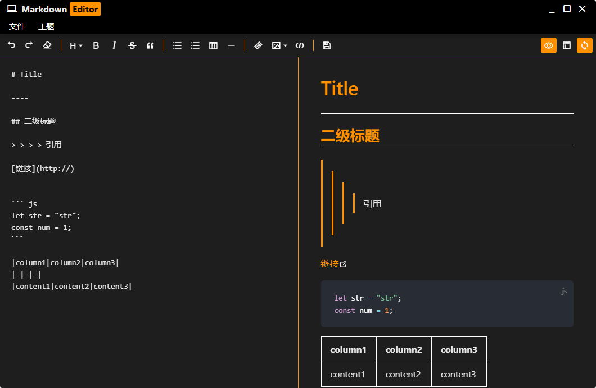
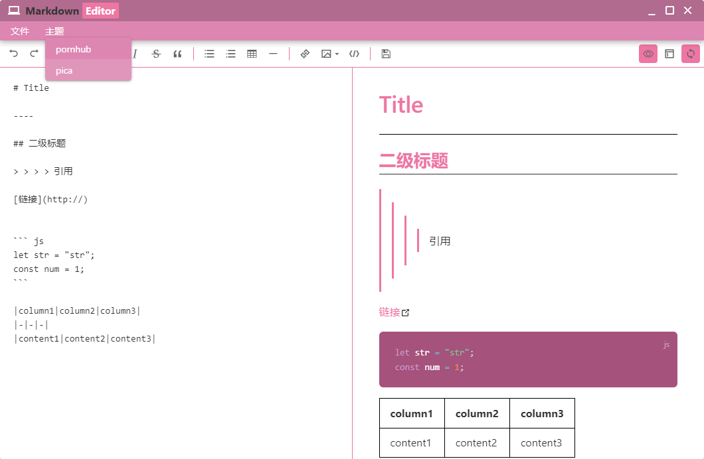

一个markdown编辑器 基于Quasar+Vite+Vue3的Electron应用

Quasar中文文档：http://www.quasarchs.com/

## 预览



## 下载
[链接](https://gitee.com/xihaya/a-markdown-editor/releases/tag/1.0.0)

## 安装依赖
推荐使用yarn
```bash
yarn
# or
npm install
```

### 启动项目

```bash
quasar dev -m electron --devtools
```

### 构建项目

```bash
quasar build -m electron
```

## 所用到的插件

### v-md-editor

https://github.com/code-farmer-i/vue-markdown-editor

对其默认样式进行了修改，修改的文件如下：

> /src/boot/@kangc/custom-base-editor.css

> /src/boot/@kangc/vuepress.css
